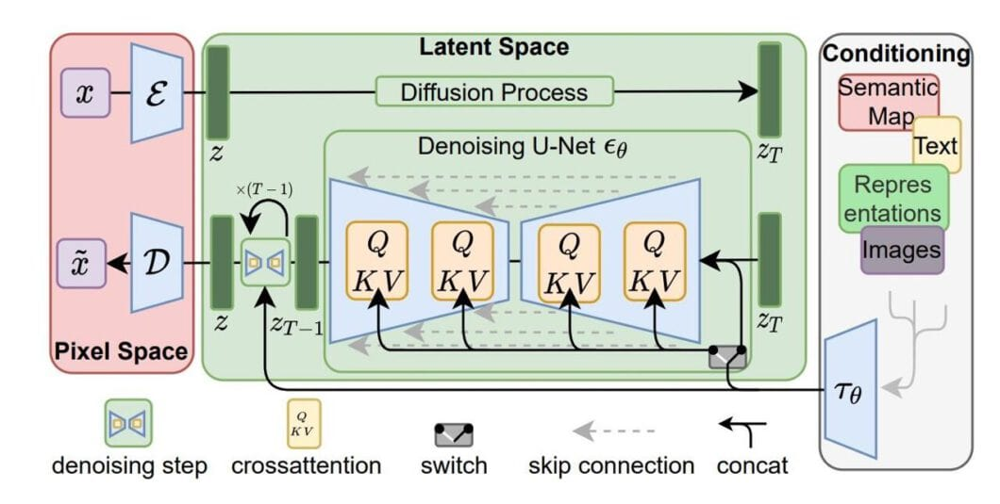

<div align="center">
  
</div>


# 🎨 KahabMiniGenT2Im

## Mini Text-to-Image Diffusion Model

<p align="center">
  
</p>

<p align="center">
  <b>A Custom Text-to-Image Diffusion Model Built with PyTorch</b><br>
  CLIP + VAE + Custom Conditional UNet + DDPM Scheduler
</p>

---

# 🚀 Project Overview

**KahabMiniGenT2Im** is a mini Stable-Diffusion-style text-to-image generator built from scratch using PyTorch and HuggingFace components.

Instead of relying entirely on `StableDiffusionPipeline`, this project:

* Builds a custom **Conditional UNet**
* Implements **Sinusoidal Timestep Embeddings**
* Uses **CLIP Text Encoder** for prompt understanding
* Uses **AutoencoderKL (VAE)** for latent space compression
* Uses **DDPM / DDIM Scheduler** for diffusion process
* Generates images directly without high-level pipelines

This project focuses on understanding the internal architecture of diffusion models.

---

# 🧠 Architecture

The model consists of:

### 1️⃣ Text Encoder

* CLIP Tokenizer
* CLIP Text Model
* Converts text prompts into embeddings

### 2️⃣ Latent Space (VAE)

* AutoencoderKL from diffusers
* Encodes images into compressed latent space
* Performs diffusion in latent space (efficient training)

### 3️⃣ Diffusion Process

* DDPMScheduler
* Forward noise addition
* Reverse denoising process

### 4️⃣ Custom Conditional UNet

* Sinusoidal time embeddings
* Residual blocks
* Cross-attention with text embeddings
* Noise prediction objective

---

# 🔬 Mathematical Objective

The model learns to predict the added noise:

[
\mathbb{E}*{t,x,\epsilon} || \epsilon - \epsilon*\theta(x_t, t, c) ||^2
]

Where:

* ( x_t ) = noisy latent
* ( t ) = timestep
* ( c ) = text conditioning
* ( \epsilon_\theta ) = predicted noise

---

# 🛠 Tech Stack

* Python
* PyTorch
* HuggingFace Transformers
* HuggingFace Diffusers
* NumPy
* PIL
* tqdm

---

# 📂 Project Structure

```
KahabMiniGenT2Im/
│
├── KahabMiniGenT2Im.ipynb
├── images/
├── captions.json
├── output/
│   └── checkpoint_epoch_600.pt
│
└── README.md
```

---

# 🏋️ Training

The model:

* Loads images and captions
* Encodes images into VAE latent space
* Samples random diffusion timestep
* Adds noise using DDPM scheduler
* Predicts noise using custom UNet
* Optimizes using MSE loss

Checkpoint example:

```
output/checkpoint_epoch_600.pt
```

---

# 🎨 Image Generation

Images can be generated directly without `StableDiffusionPipeline`:

```python
generate_images_direct(
    unet_path="output/checkpoint_epoch_600.pt",
    device="cuda"
)
```

This performs:

1. Text embedding via CLIP
2. Random latent initialization
3. Reverse diffusion loop
4. VAE decoding
5. Final image output

---

# 🔥 Key Highlights

✅ Custom Conditional UNet
✅ Sinusoidal Time Embeddings
✅ Direct Latent Diffusion
✅ Reproducible Seeding
✅ Full Training Loop
✅ Direct Sampling without high-level pipeline

---

# 🎯 Purpose of This Project

This project was built to:

* Understand Stable Diffusion internals
* Learn diffusion probabilistic modeling
* Implement conditional generative modeling
* Master latent diffusion architecture
* Prepare for advanced generative AI systems

---

# 🚀 Future Improvements

* Classifier-Free Guidance
* Better attention optimization
* Mixed Precision (FP16)
* EMA weights
* Multi-GPU training
* Improved UNet architecture
* Better dataset scaling

---

# 👨‍💻 Author

**Mohammed Kahab K**
AI Developer | Generative AI Explorer | Deep Learning Enthusiast

---

<p align="center">
⭐ If you like this project, consider giving it a star!
</p>


